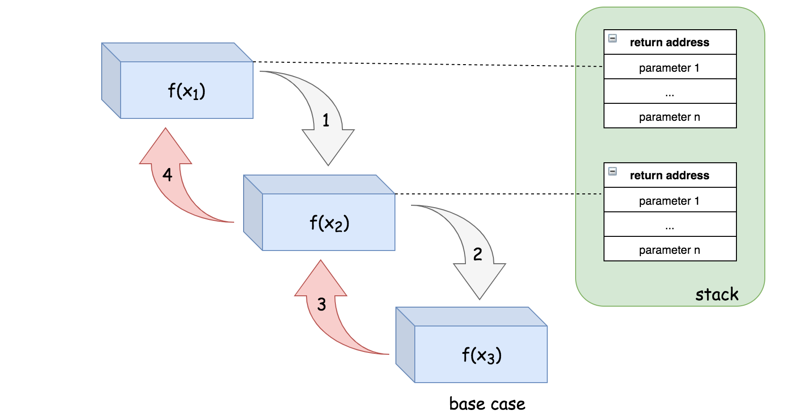

# General Structure of Recursion

```python
def solve(instance):
    if instance is simple:
        # solve instance directly
    else:
        #Divide instance into new subinstance i1,i2,i3, and so on
        solve(i1)
        solve(i2)
        solve(i3) #... and so forth for each of the subproblems
        # Reassemble the subproblem solutions to solve the entire poroblem
```
In developing a “recursive instinct,” one must learn to stop analyzing the process after the first decomposition. The rest of the problem will take care of itself; the details tend only to confuse the issue. When one cannot see the forest for the trees, it is of little use to examine the branches, twigs, and leaves. Beginners, however, often find this holistic perspective difficult to maintain. The temptation to look at each level of the process is strong, particularly when one feels doubtful about the correctness of the algorithm. Overcoming that temptation requires considerable confidence in the general mechanism of recursion, and the novice has little basis for that confidence.

Achieving the necessary confidence often requires the programmer to adopt a strategy called the **recursive leap of faith**, based on the principle that you are allowed to assume that your solution will work for simpler problems when you are trying to solve a complex one. At first, this strategy appears mystical to the point of being suspect. By becoming more familiar with recursion and by understanding its theoretical basis, however, you will discover that such faith is in fact justified.


# Recurrence Relation


There are two important things that one needs to figure out before implementing a recursive function:

- recurrence relation: the relationship between the result of a problem and the result of its subproblems.
- base case: the case where one can compute the answer directly without any further recursion calls. Sometimes, the base cases are also called bottom cases, since they are often the cases where the problem has been reduced to the minimal scale, i.e. the bottom, if we consider that dividing the problem into subproblems is in a top-down manner.

Once we figure out the above two elements, to implement a recursive function we simply call the function itself according to the recurrence relation until we reach the base case.

```
Pascal's triangle are a series of numbers arranged in the shape of triangle. In Pascal's triangle, the leftmost and the rightmost numbers of each row are always 1. For the rest, each number is the sum of the two numbers directly above it in the previous row.
```


First of all, we define a function `f(i,j)` which returns the number in the Pascal's Triangle in the i-th row and j-th column.

We then can represent the recurrence relation with the following formula:

`f(i,j)=f(i−1,j−1)+f(i−1,j)`

As one can see, the leftmost and rightmost numbers of each row are the base cases in this problem, which are always equal to 1.

As a result, we can define the base case as follows:

`f(i,j)=1 where j=1 or j=i`

As one can see, once we define the recurrence relation and the base case, it becomes much more intuitive to implement the recursive function, especially when we formulate these two elements in terms of mathematical formulas.

# Memoization

Recursion is often an intuitive and powerful way to implement an algorithm. However, it might bring some undesired penalty to the performance, e.g. duplicate calculations, if we do not use it wisely. For instance, at the end of the previous chapter, we have encountered the duplicate calculations problem in Pascal's Triangle, where some intermediate results are calculated multiple times.

In this article we will look closer into the duplicate calculations problem that could happen with recursion. We will then propose a common technique called **memoization** that can be used to avoid this problem.

Fibonacci

`F(n) = F(n - 1) + F(n - 2)`
Base Cases `F(0) = 0, F(1) = 1`

`F(4) = F(3) + F(2) = (F(2) + F(1)) + F(2)`

As you can see, in order to obtain the result for F(4), we would need to calculate the number F(2) twice following the above deduction: the first time in the first extension of F(4) and the second time for the intermediate result F(3).

This duplicated calculation happens a lot for bigger numbers

To eliminate the duplicate calculation in the above case, as many of you would have figured out, one of the ideas would be to store the intermediate results in the cache so that we could reuse them later without re-calculation.

This idea is also known as **memoization**, which is a technique that is frequently used together with recursion.


```
Memoization is an optimization technique used primarily to speed up computer programs by storing the results of expensive function calls and returning the cached result when the same inputs occur again. (Source: wikipedia)
```

We could use a hash table to keep track of the result of each F(n) with n as the key. The hash table serves as a cache that saves us from duplicate calculations. The memoization technique is a good example that demonstrates how one can reduce compute time in exchange for some additional space.

```python
def fib(self, N):
    cache = {}
    def recur_fib(N):
        if N in cache:
            return cache[N]
        if N < 2:
            result = N
        else:
            result = recur_fib(N-1) + recur_fib(N-2)
        # put result in cache for later reference.
        cache[N] = result
        return result

    return recur_fib(N)
```

# Time Complexity

Given a recursion algorithm, its time complexity O(T) is typically the product of the number of recursion invocations (denoted as R) and the time complexity of calculation (denoted as O(s)) that incurs along with each recursion call:
O(T)=R * O(s)

For recursive functions, it is rarely the case that the number of recursion calls happens to be linear to the size of input.

In this case, it is better resort to the execution tree, which is a tree that is used to denote the execution flow of a recursive function in particular. Each node in the tree represents an invocation of the recursive function. **Therefore, the total number of nodes in the tree corresponds to the number of recursion calls during the execution.**

The execution tree of a recursive function would form an n-ary tree, with n as the number of times recursion appears in the recurrence relation. For instance, the execution of the Fibonacci function would form a binary tree

In a full binary tree with n levels, the total number of nodes would be 2^n - 1 . Therefore, the upper bound (though not tight) for the number of recursion in f(n) would be 2^n - 1, as well. As a result, we can estimate that the time complexity for f(n) would be O(2^n).

In the previous chapter, we discussed the technique of memoization that is often applied to optimize the time complexity of recursion algorithms. By caching and reusing the intermediate results, memoization can greatly reduce the number of recursion calls, i.e. reducing the number of branches in the execution tree. One should take this reduction into account when analyzing the time complexity of recursion algorithms with memoization.

Let's get back to our example of Fibonacci number. With memoization, we save the result of Fibonacci number for each index n. We are assured that the calculation for each Fibonacci number would occur only once. And we know, from the recurrence relation, the Fibonacci number f(n) would depend on all n-1 precedent Fibonacci numbers. As a result, the recursion to calculate f(n) would be invoked n-1 times to calculate all the precedent numbers that it depends on.

Now, we can simply apply the formula we introduced in the beginning of this chapter to calculate the time complexity, which is O(1) * n=O(n). Memoization not only optimizes the time complexity of algorithm, but also simplifies the calculation of time complexity.


Fibonacci Without Memoization: O(2^n)
Fibonacci With Memoization: O(n)

# Space Complexitiy

There are mainly two parts of the space consumption that one should bear in mind when calculating the space complexity of a recursive algorithm: recursion related and non-recursion related space.

The recursion related space refers to the memory cost that is incurred directly by the recursion, i.e. the stack to keep track of recursive function calls. In order to complete a typical function call, the system allocates some space in the stack to hold three important pieces of information:

    The returning address of the function call. Once the function call is completed, the program must know where to return to, i.e. the line of code after the function call.
    The parameters that are passed to the function call.
    The local variables within the function call.

This space in the stack is the minimal cost that is incurred during a function call. However, once the function call is done, this space is freed.

For recursive algorithms, the function calls chain up successively until they reach a base case (a.k.a. bottom case). This implies that the space that is used for each function call is accumulated.

**For a recursive algorithm, if there is no other memory consumption, then this recursion incurred space will be the space upper-bound of the algorithm.**

For example, in the exercise of printReverse, we don't have extra memory usage outside the recursive call, since we simply print a character. For each recursive call, let's assume it can use space up to a constant value. And the recursive calls will chain up to n times, where n is the size of the input string. So the space complexity of this recursive algorithm is O(n)



It is due to recursion-related space consumption that sometimes one might run into a situation called stack overflow, where the stack allocated for a program reaches its maximum space limit and the program crashes. Therefore, when designing a recursive algorithm, one should carefully check if there is a possibility of stack overflow when the input scales up.

As suggested by the name, the non-recursion related space refers to the memory space that is not directly related to recursion, which typically includes the space (normally in heap) that is allocated for the global variables.

Recursion or not, you might need to store the input of the problem as global variables, before any subsequent function calls. And you might need to save the intermediate results from the recursive calls as well. The latter is also known as memoization as we saw in the previous chapters. For example, in the recursive algorithm with memoization to solve the Fibonacci number problem, we used a map to keep track of all intermediate Fibonacci numbers that occurred during the recursive calls. **Therefore, in the space complexity analysis, we must take the space cost incurred by the memoization into consideration.**


# Tips

**When in doubt, write down the recurrence relationship.**

Sometimes, at a first glance it is not evident that a recursion algorithm can be applied to solve a problem. However, it is always helpful to deduct some relationships with the help of mathematical formulas, since the recurrence nature in recursion is quite close to the mathematics that we are familiar with. Often, they can clarify the ideas and uncover the hidden recurrence relationship

**Whenever possible, apply memoization.**

When drafting a recursion algorithm, one could start with the most naive strategy. Sometimes, one might end up with the situation where there might be duplicate calculation during the recursion, e.g. Fibonacci numbers. In this case, you can try to apply the memoization technique, which stores the intermediate results in cache for later reuse. Memoization could greatly improve the time complexity with a bit of trade on space complexity, since it could avoid the expensive duplicate calculation.

**When stack overflows, tail recursion might come to help.**

There are often several ways to implement an algorithm with recursion. Tail recursion is a specific form of recursion that we could implement. Different from the memoization technique, tail recursion could optimize the space complexity of the algorithm, by eliminating the stack overhead incurred by recursion. More importantly, with tail recursion, one could avoid the problem of stack overflow that comes often with recursion. Another advantage about tail recursion is that often times it is easier to read and understand, compared to non-tail-recursion. Because there is no post-call dependency in tail recursion (i.e. the recursive call is the final action in the function), unlike non-tail-recursion. Therefore, whenever possible, one should strive to apply the tail recursion.


# Tail Recursion

Tail-call optimization is where you are able to avoid allocating a new stack frame for a function because the calling function will simply return the value that it gets from the called function.
Basically: Because we do not do anything with the the result of the recursive call, we dont have to keep the stack frame alive once we go "lower" in the recursive tree

TCO (Tail Call Optimization) is the process by which a smart compiler can make a call to a function and take no additional stack space. The only situation in which this happens is if the last instruction executed in a function f is a call to a function g (Note: g can be f). The key here is that f no longer needs stack space - it simply calls g and then returns whatever g would return. In this case the optimization can be made that g just runs and returns whatever value it would have to the thing that called f. **This optimization can make recursive calls take constant stack space, rather than explode. O(1) AS ONLY ONE STACK FRAME**

Consider a simple function that adds the first N natural numbers. (e.g. sum(5) = 0 + 1 + 2 + 3 + 4 + 5 = 15).

Just take into account that the language you choose has to implement tail call elimination or tail call optimization. **In the example, written in Python, if you enter a value of 1000 you get a "RuntimeError: maximum recursion depth exceeded" because the default Python implementation does not support Tail Recursion Elimination.**

```js
function recsum(x) {
    if (x === 0) {
        return 0;
    } else {
        return x + recsum(x - 1);
    }
}
```
Note how every recursive call has to complete before the JavaScript interpreter begins to actually do the work of calculating the sum.

```
recsum(5)
5 + recsum(4)
5 + (4 + recsum(3))
5 + (4 + (3 + recsum(2)))
5 + (4 + (3 + (2 + recsum(1))))
5 + (4 + (3 + (2 + (1 + recsum(0)))))
5 + (4 + (3 + (2 + (1 + 0))))
5 + (4 + (3 + (2 + 1)))
5 + (4 + (3 + 3))
5 + (4 + 6)
5 + 10
15
```

Here's a tail-recursive version of the same function:

```js
function tailrecsum(x, running_total = 0) {
    if (x === 0) {
        return running_total;
    } else {
        return tailrecsum(x - 1, running_total + x);
    }
}
```

Here's the sequence of events that would occur if you called tailrecsum(5), (which would effectively be tailrecsum(5, 0), because of the default second argument).

tailrecsum(5, 0)
tailrecsum(4, 5)
tailrecsum(3, 9)
tailrecsum(2, 12)
tailrecsum(1, 14)
tailrecsum(0, 15)
15


Consider a simple function that adds the first N natural numbers. (e.g. sum(5) = 0 + 1 + 2 + 3 + 4 + 5 = 15).

Here is a simple JavaScript implementation that uses recursion:

function recsum(x) {
    if (x === 0) {
        return 0;
    } else {
        return x + recsum(x - 1);
    }
}

If you called recsum(5), this is what the JavaScript interpreter would evaluate:

recsum(5)
5 + recsum(4)
5 + (4 + recsum(3))
5 + (4 + (3 + recsum(2)))
5 + (4 + (3 + (2 + recsum(1))))
5 + (4 + (3 + (2 + (1 + recsum(0)))))
5 + (4 + (3 + (2 + (1 + 0))))
5 + (4 + (3 + (2 + 1)))
5 + (4 + (3 + 3))
5 + (4 + 6)
5 + 10
15

Note how every recursive call has to complete before the JavaScript interpreter begins to actually do the work of calculating the sum.

Here's a tail-recursive version of the same function:

function tailrecsum(x, running_total = 0) {
    if (x === 0) {
        return running_total;
    } else {
        return tailrecsum(x - 1, running_total + x);
    }
}

Here's the sequence of events that would occur if you called tailrecsum(5), (which would effectively be tailrecsum(5, 0), because of the default second argument).

tailrecsum(5, 0)
tailrecsum(4, 5)
tailrecsum(3, 9)
tailrecsum(2, 12)
tailrecsum(1, 14)
tailrecsum(0, 15)
15

In the tail-recursive case, with each evaluation of the recursive call, the running_total is updated.
